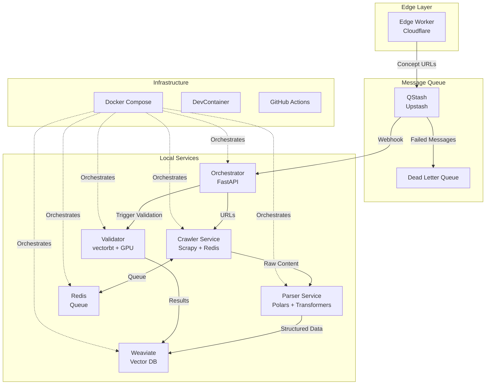

# Design Document

## Overview

The QStash Pipeline Automation system is a distributed microservices architecture that processes trading concepts through an automated pipeline. The system leverages Cloudflare Workers for edge processing, QStash for reliable message queuing, Docker containers for service orchestration, and GPU acceleration for back-testing. The entire system is designed to be deployed locally with devcontainer support and can process approximately 50 concepts per day within a 15-minute setup time.

## Architecture



## Components and Interfaces

### Edge Worker Service
**Location:** `services/edge-worker/`
**Runtime:** Cloudflare Workers
**Purpose:** Initial concept processing and URL discovery

**Interface:**
```typescript
// Input
POST /
{
  "concept": string
}

// Output
{
  "stored": number,
  "urls": string[]
}
```

**Key Files:**
- `index.js` - Main worker logic
- `wrangler.toml` - Deployment configuration
- `package.json` - Dependencies

### Crawler Service
**Location:** `services/crawler/`
**Runtime:** Python 3.11 + Scrapy
**Purpose:** URL processing and content extraction

**Interface:**
```python
# Input: Redis queue "start_urls"
# Output: QStash message to orchestrator

# Message Schema
{
  "id": str,
  "url": str,
  "content": str,
  "timestamp": str,
  "metadata": dict
}
```

**Key Files:**
- `producer.py` - QStash message publisher
- `spider.py` - Scrapy spider implementation
- `Dockerfile` - Container configuration
- `requirements.txt` - Python dependencies

**Dependencies:**
- `scrapy==2.11.0`
- `httpx[cli]==0.25.0`
- `redis==5.0.0`

### Parser Service
**Location:** `services/parser/`
**Runtime:** Python 3.11 + Polars
**Purpose:** Content processing and embedding generation

**Interface:**
```python
# Input: Raw HTML/text content
# Output: Arrow IPC stream

# Schema
{
  "text": str,
  "embedding": List[float],
  "metadata": dict,
  "processed_at": datetime
}
```

**Key Files:**
- `parser.py` - Main processing logic
- `schema.py` - Data validation schemas
- `Dockerfile` - Container configuration

**Dependencies:**
- `polars[all]==0.19.0`
- `sentence-transformers==2.2.2`
- `msgspec==0.18.0`

### Orchestrator Service
**Location:** `services/orchestrator/`
**Runtime:** FastAPI + Python 3.11
**Purpose:** Webhook handling and service coordination

**Interface:**
```python
# QStash Webhook Endpoint
POST /api/qstash
Headers:
  Upstash-Signature: JWT_TOKEN
  Content-Type: application/json

# Health Check
GET /health
Response: {"status": "healthy", "services": {...}}
```

**Key Files:**
- `main.py` - FastAPI application
- `webhook.py` - QStash webhook handler
- `auth.py` - JWT signature verification
- `Dockerfile` - Container configuration

**Dependencies:**
- `fastapi==0.104.0`
- `pyjwt[crypto]==2.8.0`
- `weaviate-client==3.25.0`

### Validator Service
**Location:** `services/validator/`
**Runtime:** Python 3.11 + CUDA
**Purpose:** GPU-accelerated back-testing

**Interface:**
```python
# Input: Trading signals and market data
# Output: Performance metrics and portfolio analysis

# Schema
{
  "portfolio_id": str,
  "returns": float,
  "sharpe_ratio": float,
  "max_drawdown": float,
  "gpu_used": bool
}
```

**Key Files:**
- `backtest.py` - Main validation logic
- `gpu_utils.py` - CUDA utilities and fallback
- `Dockerfile` - GPU-enabled container
- `requirements.txt` - Dependencies with CUDA support

**Dependencies:**
- `vectorbt==0.25.0`
- `cupy-cuda12x==12.3.0`
- `numba==0.58.0`

### Weaviate Service
**Location:** `services/weaviate/`
**Runtime:** Docker container
**Purpose:** Vector database for embeddings storage

**Interface:**
```python
# REST API endpoints
GET /v1/meta - Health check
POST /v1/objects - Store embeddings
POST /v1/graphql - Query vectors
```

**Configuration:**
- Port: 8080
- Persistence: Volume mount
- Authentication: API key based

## Data Models

### Message Schema (QStash)
```python
from msgspec import Struct
from datetime import datetime
from typing import Optional, Dict, Any

class QStashMessage(Struct):
    id: str
    url: str
    content: str
    timestamp: datetime
    metadata: Optional[Dict[str, Any]] = None
    retry_count: int = 0
```

### Embedding Schema (Weaviate)
```python
class EmbeddingObject(Struct):
    text: str
    embedding: List[float]
    source_url: str
    concept: str
    processed_at: datetime
    parser_version: str
```

### Portfolio Schema (Validator)
```python
class PortfolioResult(Struct):
    portfolio_id: str
    initial_cash: float
    final_value: float
    total_return: float
    sharpe_ratio: float
    max_drawdown: float
    trades_count: int
    gpu_accelerated: bool
    computation_time: float
```

## Error Handling

### QStash Error Handling
- **4xx Errors:** No retry, log and move to DLQ
- **5xx Errors:** Exponential backoff (10s, 30s, 60s)
- **Timeout:** 30-second timeout with retry
- **Rate Limiting:** 500 RPS with flow control

### Service Error Handling
```python
# Example error handling pattern
try:
    result = await process_message(message)
except ValidationError as e:
    logger.error(f"Validation failed: {e}")
    return {"status": "error", "type": "validation"}
except ExternalServiceError as e:
    logger.error(f"External service failed: {e}")
    await schedule_retry(message, delay=60)
except Exception as e:
    logger.error(f"Unexpected error: {e}")
    await send_to_dlq(message)
```

### GPU Fallback Strategy
```python
def get_compute_backend():
    try:
        import cupy as cp
        if cp.cuda.runtime.getDeviceCount() > 0:
            return "gpu"
    except ImportError:
        pass
    return "cpu"

def create_portfolio(backend="auto"):
    if backend == "auto":
        backend = get_compute_backend()
    
    if backend == "gpu":
        return vbt.Portfolio.from_holding(
            data, init_cash=10000, 
            jitted=dict(parallel=True)
        )
    else:
        return vbt.Portfolio.from_holding(
            data, init_cash=10000
        )
```

## Testing Strategy

### Unit Tests
**Location:** `tests/unit/`

1. **QStash Producer Tests** (`test_qstash_producer.py`)
   - Mock httpx.AsyncClient responses
   - Verify message format and headers
   - Test retry logic and error handling

2. **JWT Verification Tests** (`test_signature_verify.py`)
   - Valid signature verification
   - Invalid signature rejection
   - Expired token handling

3. **Parser Schema Tests** (`test_parser_schema.py`)
   - Arrow IPC format validation
   - Embedding dimension verification
   - Data type consistency

4. **GPU Detection Tests** (`test_backtest_gpu.py`)
   - CUDA availability detection
   - Fallback mechanism testing
   - Performance comparison

### Integration Tests
**Location:** `tests/integration/`

1. **End-to-End Pipeline** (`test_e2e_pipeline.py`)
   - Message flow from edge to storage
   - Service communication verification
   - Data consistency checks

2. **Docker Compose Tests** (`test_docker_services.py`)
   - Service startup verification
   - Health check endpoints
   - Network connectivity

### Performance Tests
**Location:** `tests/performance/`

1. **Throughput Tests** (`test_throughput.py`)
   - Message processing rate
   - GPU vs CPU performance
   - Memory usage monitoring

## Deployment Configuration

### DevContainer Setup
**File:** `.devcontainer/devcontainer.json`
```json
{
  "name": "qstash-pipeline",
  "dockerComposeFile": ["../infra/docker-compose.yml"],
  "service": "orchestrator",
  "workspaceFolder": "/workspace",
  "features": {
    "ghcr.io/devcontainers/features/docker-in-docker:2": {},
    "ghcr.io/devcontainers/features/python:1": {"version": "3.11"}
  },
  "postCreateCommand": "pip install -r requirements-dev.txt",
  "extensions": [
    "github.copilot",
    "kyouko-kujira.kiro",
    "ms-python.black-formatter",
    "charliermarsh.ruff"
  ]
}
```

### Docker Compose Configuration
**File:** `infra/docker-compose.yml`
```yaml
version: "3.9"
networks:
  cogv: {}

services:
  redis:
    image: redis:7-alpine
    networks: [cogv]
    volumes: [redis_data:/data]

  weaviate:
    image: semitechnologies/weaviate:1.25.4
    ports: ["8080:8080"]
    environment:
      QUERY_DEFAULTS_LIMIT: 25
      AUTHENTICATION_ANONYMOUS_ACCESS_ENABLED: 'true'
      PERSISTENCE_DATA_PATH: '/var/lib/weaviate'
    volumes: [weaviate_data:/var/lib/weaviate]
    networks: [cogv]

  orchestrator:
    build: ../services/orchestrator
    ports: ["8000:8000"]
    environment:
      - QSTASH_SIGNING_KEY=${QSTASH_SIGNING_KEY}
      - WEAVIATE_URL=http://weaviate:8080
    depends_on: [weaviate, redis]
    networks: [cogv]

  crawler:
    build: ../services/crawler
    environment:
      - QSTASH_URL=${QSTASH_URL}
      - QSTASH_TOKEN=${QSTASH_TOKEN}
      - REDIS_URL=redis://redis:6379
    depends_on: [redis]
    networks: [cogv]

  parser:
    build: ../services/parser
    depends_on: [redis]
    networks: [cogv]

  validator:
    build: ../services/validator
    runtime: nvidia
    deploy:
      resources:
        reservations:
          devices:
            - capabilities: ["gpu"]
    networks: [cogv]

volumes:
  redis_data:
  weaviate_data:
```

### Environment Variables
**File:** `infra/.env` (git-ignored)
```bash
# QStash Configuration
QSTASH_URL=https://qstash.upstash.io/v2/publish
QSTASH_TOKEN=your_qstash_token
QSTASH_SIGNING_KEY=your_signing_key

# Service Configuration
REDIS_URL=redis://redis:6379
WEAVIATE_URL=http://weaviate:8080

# GPU Configuration
CUDA_VISIBLE_DEVICES=0
```

## Security Considerations

### Secret Management
- Environment variables stored in `.env` (git-ignored)
- VS Code secrets for development
- JWT signature verification for webhooks
- API key rotation strategy

### Network Security
- Internal Docker network isolation
- Service-to-service authentication
- Rate limiting and DDoS protection
- HTTPS enforcement for external APIs

### Data Protection
- Embedding data encryption at rest
- Secure backup to R2 storage
- PII scrubbing in logs
- Access control for sensitive endpoints

## Monitoring and Observability

### Health Checks
- Service health endpoints (`/health`)
- Dependency health verification
- GPU availability monitoring
- Queue depth monitoring

### Metrics Collection
- Message processing throughput
- Error rates by service
- GPU utilization metrics
- Response time percentiles

### Logging Strategy
- Structured JSON logging
- Correlation IDs for tracing
- Error aggregation and alerting
- Performance metrics dashboard

## Backup and Recovery

### Data Backup
- Nightly Weaviate data sync to R2
- Redis persistence configuration
- Configuration backup strategy
- Disaster recovery procedures

### Recovery Procedures
- Point-in-time recovery from backups
- Service restart automation
- Data consistency verification
- Rollback procedures for failed deployments